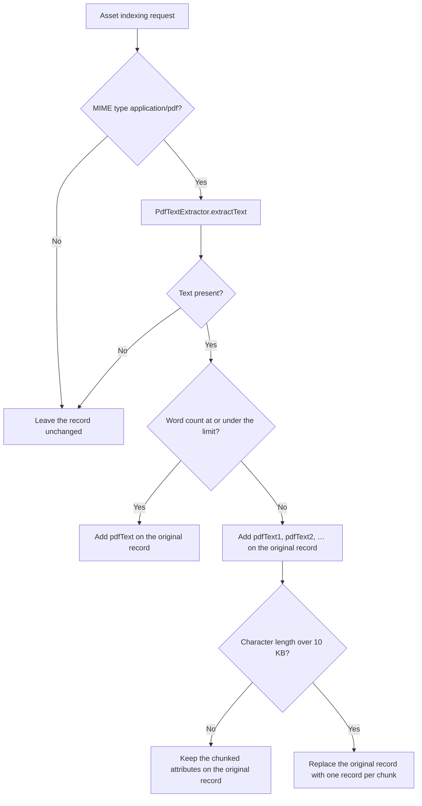

# PDF Text Extractor

`DefaultAlgoliaPdfTextExtractor` is an asset request extender. When the indexer prepares a record for a PDF asset, this service reads the document text and writes it onto the Algolia record so the PDF body is searchable.

Source: [`DefaultAlgoliaPdfTextExtractor`](../core/src/main/java/com/algolia/core/extender/internal/DefaultAlgoliaPdfTextExtractor.java).

---

## Table of contents

1. [When it runs](#when-it-runs)
2. [How text is stored](#how-text-is-stored)
3. [Record splitting](#record-splitting)
4. [Configuration](#configuration)
5. [Dependencies](#dependencies)

---

## When it runs

The component is an OSGi service named **Algolia PDF Text Extractor**. It implements `AlgoliaAssetRequestExtender` only, so it appears in the **Asset Request Extender Service** dropdown and not in the page dropdown.

`augmentAlgoliaRequest` runs after the indexer has created the asset’s `AlgoliaRequest`. The method returns immediately unless the asset MIME type is `application/pdf`. Non-PDF assets, including a null MIME type, are left unchanged.

For a PDF, it calls the indexer’s `PdfTextExtractor.extractText`. Empty or null text is ignored. The original record is not given a `pdfText` attribute in that case.

---

## How text is stored

Words are counted with OpenNLP `WhitespaceTokenizer`. The limit is the OSGi **Word Size Limit** (default **900**).

| Extracted text | Attributes written | Records |
|---|---|---|
| Word count ≤ limit | One attribute, `pdfText`, holding the full string | The original asset record |
| Word count > limit, and the string is 10 KB or shorter | `pdfText1`, `pdfText2`, … each holding up to the word limit | Still the original asset record |
| Word count > limit, and the string is longer than 10 KB | Each chunk becomes the `pdfText` attribute of its own record | The original record is removed. See [Record splitting](#record-splitting) |

A chunk is the word limit words, joined with single spaces. The last chunk holds the remainder. Attribute numbering starts at `pdfText1`. There is no bare `pdfText` attribute once the word count exceeds the limit.

Example with the default limit of 900 and 1,801 words, while the string stays under 10 KB: the original record gains `pdfText1` (900 words), `pdfText2` (900 words), and `pdfText3` (1 word).

The 10 KB check uses `String.length()` on the full extracted text, not the size of the finished Algolia JSON record. The constant is `RECORD_SIZE_LIMIT` (`10 * 1024`). Text that is exactly 10 KB is not split into extra records.

---

## Record splitting

Splitting runs only when both are true: the word count is over the limit, and `text.length()` is greater than 10 KB.

For each attribute whose name starts with `pdfText`, the extender:

1. Builds a new `AlgoliaRecord` whose object ID is `{originalObjectID}_{index}`, starting at `0`.
2. Copies that chunk onto the new record as `pdfText` (the same value, under the name `pdfText`).
3. Sets `path` to the asset path (`AlgoliaConstants.ATTRIBUTE_PATH`).
4. Adds the record to the request.

It then removes the original record (the one whose object ID was captured before splitting). Other attributes that the indexer had placed on the original record are not copied onto the split records. Each split record contains the object ID, `pdfText`, and `path`.

After the swap it calls `AlgoliaUtil.handleSplitRecordCount` with `SplitRecordAction.ADD`, the asset path, the number of remaining records, and the `ResourceResolverFactory`. It also sets `AlgoliaRequest.setPdfTextSplittingAttempted(true)` so the indexer can tell this path was taken.

---

## Configuration

The metatype is **DefaultAlgoliaPdfTextExtractor Configuration**.

| Property | OSGi id | Default | Meaning |
|---|---|---|---|
| Word Size Limit | `word.size.limit` | `900` | Maximum words stored in a single `pdfText` attribute before the text is partitioned |

The component declares the default in code (`word_size_limit() default 900`) and in the OSGi component descriptor. Change it with an OSGi configuration for PID `Algolia PDF Text Extractor` (the component `name`), property `word.size.limit`.

A lower limit produces more `pdfTextN` attributes and, once the full string exceeds 10 KB, more Algolia records. A higher limit keeps more text on fewer attributes and can produce a record Algolia will reject if a single attribute or the record exceeds Algolia’s size limits. 900 words is the shipped default; validate record size against your index settings before raising it.

---

## Dependencies

| Service or library | Use |
|---|---|
| `PdfTextExtractor` | Reads text from the DAM `Asset`. Provided by the indexer. |
| `ResourceResolverFactory` | Passed to `AlgoliaUtil.handleSplitRecordCount` when records are split |
| `opennlp-tools` 2.5.0 | `WhitespaceTokenizer` for the word count and the partitions |

The extractor logs `Encountered PDF asset, extracting text from it.` at info when it sees a PDF.

---

**Related docs**

| Doc | Topics |
|---|---|
| [Installation](INSTALLATION.md) | Build, deploy, and select the extender |
| [Tags Extractor](TAGS.md) | The page and asset tags extender |
| [Custom extensions](CUSTOM_EXTENSIONS.md) | The `AlgoliaAssetRequestExtender` contract |
